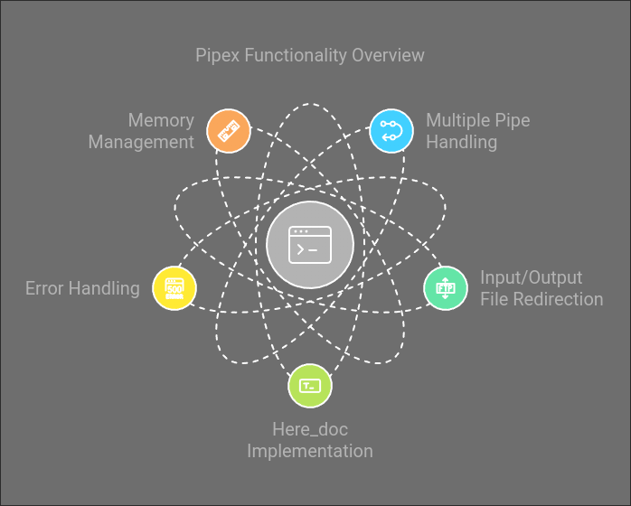
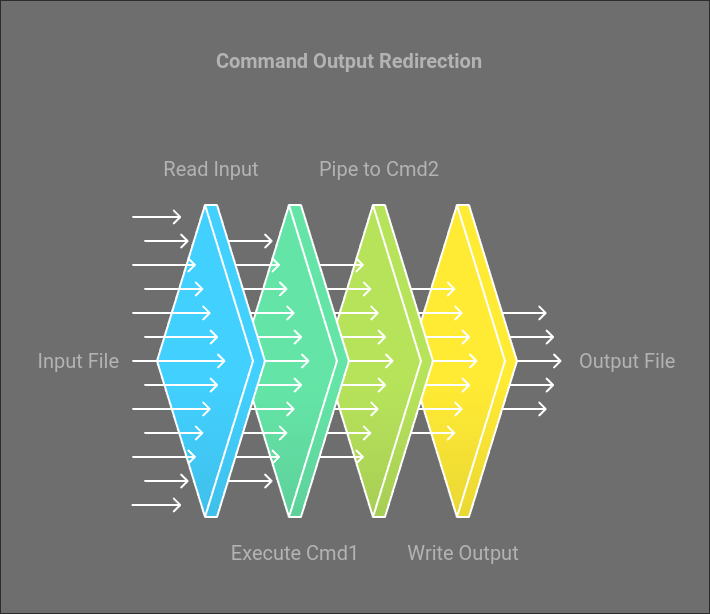
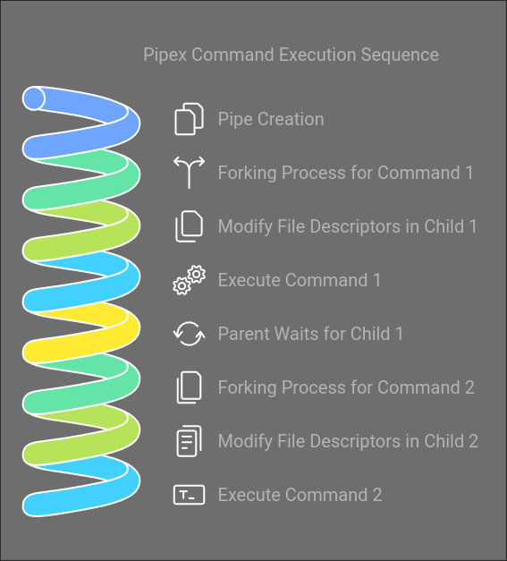

# Pipex

---


---

## Table of Contents

1. [Description](#description)
2. [Features](#features)
3. [Installation](#installation)
4. [How it works](#how-it-works)
5. [Pipes and Forks](#pipes-and-forks)
6. [Here_doc](#here_doc)
7. [Usage](#usage)
8. [Examples](#examples)
9. [Error Handling](#error-handling)
10. [Project Structure](#project-structure)
11. [Technical Details](#technical-details)
12. [Author](#author)
13. [License](#license)

---

## Description

Pipex is a program that mimics the behavior of the shell command:

```
< file1 cmd1 | cmd2 > file2
```

This project is part of the 42Lisboa curriculum, designed to help students understand how the Unix shell handles pipes, process creation, and redirection.

---

## Features

- Multiple pipe handling
- Input/Output file redirection
- Here_doc implementation
- Error handling
- Memory management



---

## Installation

```bash
git clone https://github.com/jcmspg/pipe_x.git
cd pipe_x
make
```

---

## How it works

The program takes four or more arguments:

1. Input file
2. First command
3. Second command
4. Nth command (optional)
5. Output file



Here’s the step-by-step process:

1. **Read Input File**: The program reads from the input file specified in the arguments and feeds its contents into the first command.
2. **Execute Command Chain**: The first command’s output is redirected to the second command’s input, and so on, forming a chain of processes connected by pipes.
3. **Output File**: The output of the final command in the chain is written to the specified output file.
4. **Wait for Processes**: The program waits for all the processes (commands) to complete.
5. **Exit**: Once all processes finish, the program exits.

---

## Pipes and Forks

In Unix-based systems, pipes allow the output of one process to be used as input to another. Here's how Pipex handles pipes and forks:

1. **Pipe Creation**: Pipex creates a pipe using the `pipe()` system call. A pipe is essentially two file descriptors: one for reading and one for writing.

2. **Forking Processes**: For each command, the program uses `fork()` to create a new process. The child process is responsible for executing the command.
    - In the child process:
        - The input/output file descriptors are modified using `dup2()` to connect the pipe with standard input/output.
        - The command is then executed with `execve()`.
    - In the parent process:
        - It waits for the child to finish using `waitpid()` before proceeding to the next command.

3. **Redirection**: For the first command, Pipex redirects the input file to the standard input using `dup2()`. For the last command, Pipex redirects the standard output to the output file. Intermediate commands read from and write to the pipe created by the program.

This mechanism allows the output of one command to flow into the input of the next, mimicking shell behavior.



---

## Here_doc

The `here_doc` feature simulates the shell’s `<<` functionality, allowing the user to input data directly into the program until a specified delimiter is encountered. Here’s how it works in Pipex:

1. **Usage**: When using `here_doc`, the user provides a delimiter (a specific word or string).

   ```bash
   ./pipex here_doc LIMITER "grep a" "wc -l" outfile
   ```

2. **Input Process**: The program reads input from the user line by line until the delimiter is found. This input is used as the input file for the first command.

3. **Functionality**: Internally, Pipex creates a pipe where the input is fed. Once the delimiter is encountered, the input is closed, and the subsequent commands are executed using the input provided through the pipe.

This feature is helpful for scenarios where direct input is needed without using an actual file.

---

## Usage

```bash
./pipex file1 cmd1 cmd2 file2
```

This is equivalent to the shell command:

```bash
< file1 cmd1 | cmd2 > file2
```

---

## Examples

```bash
./pipex infile "ls -l" "wc -l" outfile
```

This will list the files in the current directory and count the number of lines in the output.

### Here_doc Example

```bash
./pipex here_doc LIMITER "grep a" "wc -l" outfile
```

This will count the number of lines containing the letter 'a' in the here_doc input.

### Multiple Pipes Example

```bash
./pipex infile "ls -l" "grep a" "wc -l" outfile
```

This will list the files in the current directory, filter the output to only show lines containing the letter 'a', and count the number of lines in the output.

---

## Error Handling

The program handles various error cases:
- Invalid number of arguments
- File permission errors
- Command execution errors
- Memory allocation errors
- Pipe creation errors

---

## Project Structure

```
.
├── Makefile          # Compilation rules
├── README.md         # Project description
├── inc               # Header and library files
│   ├── libft         # 42's C library
│   ├── libft.h       # Header for libft functions
│   ├── libft.a       # Compiled libft library
│   ├── ft_printf.h   # Header for printf functions
│   ├── get_next_line.h # Header for line reading functions
├── src               # Source files
│   ├── checker_utils.c  # File permission checks
│   ├── debug_utils.c    # Debugging functions
│   ├── free_utils.c     # Memory management
│   ├── here_doc.c       # Here_doc implementation
│   ├── main.c           # Main program logic
│   ├── pipe_utils.c     # Pipe handling functions
│   ├── pipe_utils2.c    # Additional pipe handling functions
│   ├── pipex.c          # Main pipex logic
│   ├── pipex.h          # Program header
│   ├── parse_utils.c    # Command parsing
│   ├── parse_utils2.c   # Additional command parsing
│   ├── init_utils.c     # Initialization functions
│   ├── validation.c     # Argument validation
├── obj               # Compiled object files
```

---

## Technical Details

- **Language**: C
- **External functions allowed**:
  - `open`, `close`, `read`, `write`
  - `malloc`, `free`
  - `perror`, `strerror`
  - `pipe`, `fork`, `dup2`, `execve`, `waitpid`
  - `exit`

---

## Author

João Gomes
joamiran@student.42lisboa.com

---

## License

This project is licensed under the MIT License - see the [LICENSE](LICENSE) file for details.
